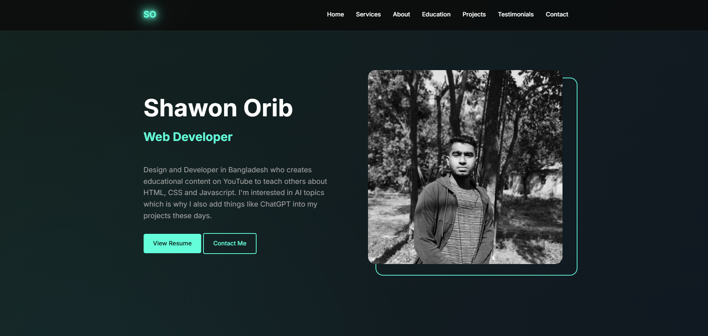

# Web Developer Portfolio

A modern, responsive portfolio website built with HTML, CSS, and JavaScript. This portfolio showcases professional experience, projects, and services in a clean and engaging layout.

 <!-- You should add a screenshot of your website here -->

## Features

- 📱 Fully responsive design that works on all devices
- 🎨 Modern and clean UI/UX
- 🌟 Smooth animations and transitions
- 📑 Multiple sections including:
  - Hero section with CTA
  - Services overview
  - About me with skill bars
  - Education & Experience timeline
  - Project showcase
  - Client testimonials
  - Contact form
- 🍔 Mobile-friendly navigation menu
- 🔗 Social media integration

## Technologies Used

- HTML5
- CSS3
- JavaScript (Vanilla)
- Font Awesome Icons
- Google Fonts (Inter)

## Getting Started

1. Clone the repository:
```bash
git clone https://github.com/shawonorib/portfolio-template-1.git
```

2. Open `index.html` in your browser to view the website.

3. To make changes:
   - Edit `index.html` for content changes
   - Modify `style.css` for styling updates
   - Update images in the project by replacing the image URLs

## Project Structure

```
portfolio-website/
│
├── index.html              # Main HTML file
├── style.css              # Stylesheet file
├── shawon-logo-without-bg.png    # Logo file
├── Sample_Resume_Template.pdf    # Resume file
└── README.md              # Project documentation
```

## Customization

1. **Personal Information**: Update the text content in `index.html` to reflect your personal information, skills, and experiences.

2. **Images**: Replace the image URLs with your own images or update the paths to local image files.

3. **Colors & Styling**: Modify the CSS variables in `style.css` to match your preferred color scheme.

4. **Projects**: Add or remove project cards in the projects section to showcase your work.

5. **Contact Information**: Update the contact section with your actual contact details.

## Contributing

Feel free to fork this project and submit pull requests for any improvements.

## License

This project is open source and available under the [MIT License](LICENSE).

## Contact

Shawon Orib
- Email: [Shawon Orib](mailto:shawonorib@gmail.com)
- LinkedIn: [Shawon Orib](https://linkedin.com/in/shawonorib)
- GitHub: [ShawonOrib](https://github.com/shawonorib)

---
Made with ❤️ by Shawon Orib
